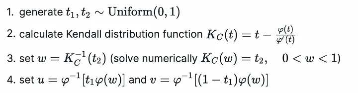

Gaussian Copula modelling for pairs trading of many securities:

https://github.com/AnsonCHOWcm/PairTrading_Copula_Backtrader/blob/main/BackTrader_Copula_PairTrading_Hourly.py

get dataset
find cointegrated series ? then create the instrument in a pairs trading sense
either find pairs and employ strat
OR
do copula modelling and do individual stock longing rather than pairs

START yourself then change analysis to back trader refactor

### Things to do
1. Fit to two pairs of data a copula in jupyter notebook. Put into python file after
2. Expand by increasing the number of series and create
   1. either cointegrated pairs by testing of kental tau/johensen cointegration
   2. all together
3. Based on the above two approaches, create a basic trading strategy.

Create archimedian copula class, methods should include
give generator function --> find the inverse and the pdf and lamdifty it by sympy
fit based on negative log likelihood of the copula pdf based on u1, u2 from INTERPOLATED ECDF (without 0, 1 extremes)

### Sampling Algorithm

